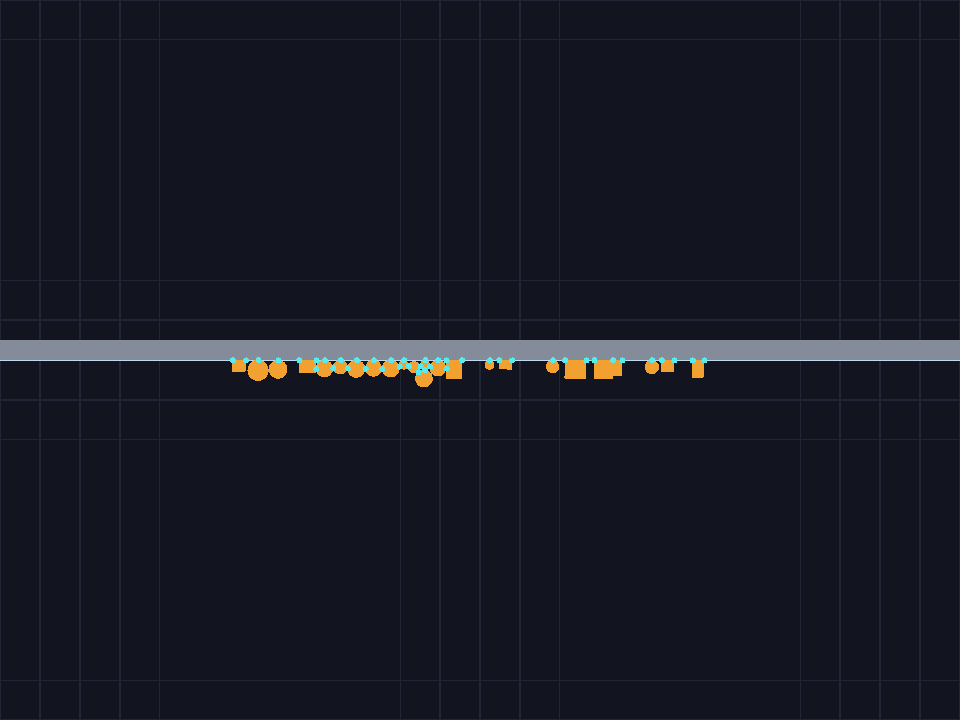

# Tumble Lab

[](https://github.com/DanielCuevas1208/tumble-lab/actions/workflows/ci.yml)
[](LICENSE)

Tumble Lab is a 2D rigid-body physics engine written in Lua from first principles. It solves circle and polygon collisions with a sequential impulse solver. Interactive scenes run in the LOVE framework. A deterministic headless mode runs the same engine without a window.



## What it does

The engine owns a world of rigid bodies. Bodies move under gravity and forces. Contacts between bodies resolve with impulses. The solver runs a fixed number of iterations per step for stable results.

The engine stores no external math library. It implements vectors, a seeded random generator, shape mass properties, and convex collision tests from scratch. The whole engine fits in a few small modules.

The same code runs in three ways:

1. In LOVE as an interactive sandbox.
2. Headless as a command line tool.
3. Inside the test suite.

This design keeps the engine honest. Every behavior is observable without a screen.

## Features

- Circle and convex polygon shapes.
- Circle-circle, circle-polygon, and polygon-polygon collision.
- Sequential impulse solver with warm starting.
- Coulomb friction and restitution.
- Deterministic stepping and recording.
- Seeded random generation for reproducible scenarios.
- Headless runner and snapshot renderer.
- LOVE sandbox with interactive body dropping.

## Architecture

```
tumble-lab/
  engine/         core engine modules
    collide/      narrowphase collision routines
    body.lua      rigid body definition
    config.lua    solver tuning constants
    recorder.lua  simulation recording and replay
    rng.lua       deterministic Park-Miller generator
    shape.lua     shape builders and mass properties
    solver.lua    sequential impulse solver
    vec.lua       2D vector math
    world.lua     bodies, stepping, contact generation
  scenes/         LOVE sandbox scene and renderer
  scenarios/      shared demo scenarios
  spec/           busted test suite
  tools/          headless runner and snapshot tool
```

The engine splits into three layers:

1. Geometry. Shapes describe circles and convex polygons. `shape` computes mass and inertia.
2. Detection. `collide` finds contacts between shape pairs.
3. Solving. `solver` applies impulses that keep bodies apart.

The world ties the layers together. It steps bodies, builds contacts, and runs the solver in a fixed order. That order makes every run deterministic.

The recorder stores the full simulation as text. A replay rebuilds the world and reproduces the run exactly. The `.tumble` file format is stable and plain.

## Setup

You need three tools:

- Lua 5.4 or LuaJIT 2.1.
- LuaRocks.
- LOVE 11.5 (for the sandbox only).

Install the test dependencies with LuaRocks:

```
luarocks install busted
luarocks install luacheck
luarocks install stylua
```

Install the exact versions that CI uses. Check `.github/workflows/ci.yml` for the versions.

## Run

Run a scenario headless:

```
lua tools/run.lua stack
```

Run one scenario with a fixed step count:

```
lua tools/run.lua drop --steps 240
```

Record a simulation and verify a replay is identical:

```
lua tools/run.lua heap --record run.tumble
lua tools/run.lua --replay run.tumble
```

Render a scene to an image without a window:

```
lua tools/snapshot.lua heap scene.ppm --steps 600
```

Convert the image to PNG with a tool such as ffmpeg:

```
ffmpeg -y -i scene.ppm scene.png
```

Open the interactive sandbox:

```
love .
```

Press 1 to 4 to switch scenes. Press space to pause. Press s to step once. Press r to reset. Click to drop a body.

## Sample output

A headless run of the drop scenario:

```
$ lua tools/run.lua drop --steps 120
scenario: drop | steps: 120 | dt: 0.016666666666666666 | simulated: 2.000 s
bodies: 2
id  shape             x          y         vx         vy      angle
1   polygon      0.0000     0.2500     0.0000     0.0000     0.0000
2   circle       0.0000    -0.1950     0.0000    -0.0004     0.0000
contact impulse (last step): 0.020532
```

A record and replay verification:

```
$ lua tools/run.lua heap --record run.tumble
$ lua tools/run.lua --replay run.tumble
replay: run.tumble | frames: 1800 | dt: 0.016666666666666666 | tolerance: 0
result: identical
```

## Testing

Run the full suite:

```
busted spec
```

The suite covers vectors, shapes, collision, the solver, the world, recording, scenarios, the headless runner, and the snapshot renderer. Determinism tests compare two runs for exact equality.

Run static analysis:

```
luacheck .
```

Check formatting:

```
stylua --check .
```

### Test status

The suite has 73 passing tests and no failures on Lua 5.4. CI also runs the suite on LuaJIT. A record and replay cycle reproduces the recorded frames exactly.

## Limitations

- The broad phase tests every body pair. Large scenes slow down.
- Position correction uses Baumgarte. Deep stacks can be softer than production engines.
- Shapes are convex polygons and circles only. There are no concave shapes or compound bodies.
- There are no joints. Constraint types such as revolute and distance joints are not implemented.
- There is no body sleeping. Resting simulations keep stepping.
- There is no continuous collision detection. Fast bodies can tunnel.
- Recordings store full precision text. Large recordings produce large files.

## Roadmap

See [ROADMAP.md](ROADMAP.md) for the completed work and the planned milestones.

## License

This project is licensed under the MIT License. See [LICENSE](LICENSE).
